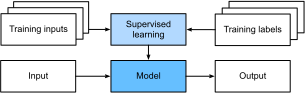

# مقدّمة
:label:`chap_introduction`

حتى وقت قريب ، تمّ تطوير كُلّ برامج الكمبيوتر التّي نتفاعل معها يوميًا بواسطة مُطوِّري البرامج من المبادئ الأولى للبرمجة. فمثلا لو أردنا كتابة برنامج لإدارة منصّة تجارة إلكترونية ، سنتبع التّمَشّي التّالي: سنجتمع مع كل المطوّرين المكلّفين بالمشروع  حول لوحة بيضاء لبضع ساعات للتفكير في جميع ميزات المنصّة و كيفية تفاعلها مع المُستخدم. بعد هذه المرحلة من التفكير، سنصل إلى عدد كبير من الحلول العمليّة التّي قد تبدو كالتالي: (1) يتفاعل المستخدمون مع التطبيق من خلال واجهة تعمل في متصفح الويب أو تطبيق المحمول ؛ (2) يتفاعل تطبيقنا مع محرك قاعدة بيانات من الدرجة التجارية لتتبُّع حالة كل مستخدم والحفاظ على سجلات معاملاته التاريخية ؛ و (3) في قلب تطبيقنا، سنفصّل منهجيّة عمل البرنامج في جميع الحالات المُمكنة حتى تصير مجموعة القواعد هذه *كعقل* مدبّر للبرنامج  حتى يتّخذ الإجراء المناسب في كُلّ ظرف يمكن تصوُّره.

لبناء *العقل المدبّر* لتطبيقنا ، كان علينا أن نفكّر في كل حالة ممكنة نتوقع مواجهتها ، ووضع قواعد مناسبة لها. فمثلا، في كل مرة ينقر فيها العميل لإضافة منتج إلى سلة التسوق الخاصة به ، نضيف إدخالًا إلى جدول قاعدة بيانات عربة التسوق ، ونربط معرِّف المستخدم بمعرِّف المنتج المطلوب. رغم أنّ قلّة من المُطوّرين يمكنهم كتابة كُلّ قواعد هذه المنصّة من دون أخطاء من المرّة الأولى (فقد يستغرق الأمر القيام ببعض الاختبارات لتجنّب أيّ خلل ممكن) ، في الأغلب ، يُمكننا كتابة مثل هذا البرنامج من المبادئ الأولى وإطلاقه بثقة * قبل إختباره مع أيّ عميل حقيقي*. تُعد قدرتنا، هذه، على تصميم أنظمة تلقائية من المبادئ الأولى و التي بإمكانها أن تحرك المنتجات والأنظمة العاملة ، غالبًا في مواقف جديدة ، قدرة إدراكيًةً ملحوظًة. و قبل أن نغوص في عالم تعلّم الآلة، إعلم أنّه عندما تكون قادرًا على ابتكار حلول برمجيّة تعمل بنسبة 100٪ \٪ من الوقت للمشكلة المعروضة ، *فيجب ألاَّ تستخدم التعلم الآلي *.

لحُسن حظّ المجتمع المتنامي لعلماء و مختصّي تعلّم الآلة ، فإن العديد من المهام و المشاكل التي نرغب في تشغيلها أو حلّها تلقائيًا (عبر تطوير برامج لحلّها) لا تنحني بسهولة للإبداع البشري. فمثلا، تخيّل أن تجمع أذكى العقول التي تعرفها ، لتعالج إحدى المشاكل التالية:

* كتابة برنامجٍ يتنبأ بطقس الغد في ضوء مجموعة من المعلومات الجغرافية وصور الأقمار الصناعية و حالة الطقس في عدد من الأيام السابقة.
* كتابةُ برنامجٍ يأخذ سؤالًا ، معبّرًا عنه بنصّ حرّ ، و يتكمن من الإجابة عنه بشكل صحيح.
* كتابةُ برنامجٍ يتمكن من تحديد جميع الأشخاص الموجودين في صورة ما ، ورسم الخطوط العريضة حول مكان وجود كل منهم في الصورة.
* كتابةُ برنامجٍ يقدم للمستخدمين منتجات يُرجّح أن يستمتعوا بها ولكن من غير المرجّح أن يُصَادفُوها أثناء الاستعراض الطبيعي.

في كُلّ من هذه الحالات ، لا يمكن ، حتّى لنخبة المبرمجين ، كتابةُ القواعد اللّازمة لتطوير بَرامج كفيلة بأن تحلّ هذه المشاكل من الصفر. و سبب ذلك قد يختلف من حالة إلى أخرى. ففي بعض الأحيان يتبع البرنامج الذي نبحث عنه نمطًا يتغير مع مرور الوقت ، و عندها سيكون على المبرمج تكييف و تحديث البرنامج كلّما تغييّر. في حالات أخرى ، قد تكون العلاقة (على سبيل المثال بين البكسلات في صورة ما والفئات المجردة - كالإنسان و السيارة، الخ..) معقدة للغاية ، حيث أنّ إيجاد هذه العلاقة قد يتطلّب آلاف أو ملايين الحسابات التي تفوق فهمنا الواعي (حتى لو كانت أعيننا يمكنها أن تقوم بهذه المهمة دون عناء!).

تعلُّم الآلة (ML) هو دراسة التّقنيات الفعّالة التي يُمكنها أن *تتعلم* من *التجربة*. بالإعتماد على هذه التقنيات، تُرَاكِمُ خوارزميات ML المزيد من الخبرة ، عادةً في شكل بيانات مراقبة أو تفاعلات مع بيئة معيّنة ، ممّا يؤدّي إلى تحسين أدائها. قارن هذه التقنيات مع نظام التجارة الإلكترونية الجامد ، والذي يعمل وفقًا لمنطق الأعمال نفسه ، بغض النظر عن مقدار الخبرة المكتسبة ، حتى يتعلّم المطورون أنفسهم ويقرروا بأنّ الوقت قد حان لتحديث البرنامج.

 في هذا الكتاب ، سوف نُعلّمك أساسيات تعلّم الآلة ، ونركّز بشكل خاص على التعلّم العميق ، وهي مجموعة فعّالة من التقنيات التي تقود، في الوقت الرّاهن، الابتكارات في مجالات متنوعة مثل رؤية الكمبيوتر ، ومعالجة اللغات الطبيعية ، والرعاية الصحية ، وعلم الجينات.

تَعلُّمُكَ لمُحتوى هذا الكتاب سيفتح لك الباب نحو مجالات عمل متنوّعة و مشوقة. والأفضل من ذلك أنّه سيفتح أبوابا جديدة للإبداع قد تساعدك ، كما نرجوا، في تطوير مشاريعك الخاصّة.

## مثال تحفيزي

قبل أن نتمكن من البدء في كتابة هذا الكتاب كان علينا نأخذ كفايتنا من القهوة. ثم ركبنا سيارة و بدأنا بالقيادة. باستخدام جهاز iPhone ، أطلق ألكس (أحدّ المؤلفين) إسم "Hey Siri" ، لإيقاظ نظام التعرّف على الصوت في هاتفه. ثم أمر مو(مؤلف آخر)  الهاتف بعرض "الاتجاهات إلى مقهى Blue Bottle". سرعان ما تمكّن الهاتف من تحويل الأمر الشفوي إلى نصّ مكتوب على الشّاشة. كما أدرك أننا نطلب التوجيهات وأطلق تطبيق الخرائط. بمجرد إطلاق التطبيق ، حدّد تطبيق الخرائط عددًا من الطرق. بجانب كل مسار ، عرض الهاتف الوقت المتوقّع لبلوغ المقهى.

على الرغم من أنّنا اخترعنا هذه القصة لغرض تعليميّ ، إلا أنها توضّح أنّه ، خلال بضع ثوانٍ فقط ، يُمكن لتفاعلاتنا اليومية مع الهاتف الذّكي أن تُشرِكَ العديد من نماذج خوارزميّات تعلّم الآلة.

تخيّل مجرد كتابة برنامج للردّ على كلمة تنبيهٍ * مثل "Alexa" أو "Okay, Google" أو "Siri". جرِّب تطوير حلّ لهذا المشكل لوحدك دون أي شيء سوى جهاز كمبيوتر ومحرّر كود ، كما هو موضح في :numref:`fig_wake_word`. كيف تكتب مثل هذا البرنامج بإستعمال لغة برمجة فقط؟ فكّر في الأمر ... المشكلة صعبة. كل ثانية ، سيجمع الميكروفون حوالي 44000 عيّنة. كل عيّنة هي قياسٌ لسعة الموجة الصوتية. ما القاعدة التي يمكنّها أن تعيّن من مقتطف الصوت الخام تنبؤا موثوق به ``{نعم ، لا}`` حول ما إذا كان المقتطف يحتوي على كلمة التنبيه؟ إذا أشكل عليك إيجاد مثل هذه القاعدة ، فلا تقلق. لا نعرف كيفية كتابة مثل هذا البرنامج من الصفر أيضًا. هذا هو سبب استخدامنا لتعلّم الآلة ML.


:label:`fig_wake_word`

كيف نعرف أنّه رغم عدم قدرتنا على كتابة قواعد واضحة لكيفية حلّ المشكل السابق، يمكن لخوارزميات تعلُّم الآلة أن تجد له حلّا؟

ها هي الحيلة. في كثير من الأحيان ، حتى عندما لا نعرف كيفية إخبار الحاسوب بشكل صريح عن الطريقة المثلى للتّعيين من المدخلات (inputs) إلى المخرجات (outputs) ، فنحن قادرون مع ذلك على أداء هذا العمل الإدراكي بأنفسنا. بمعنى آخر ، حتى لو كنت لا تعرف *كيفية برمجة جهاز كمبيوتر* للتعرف على كلمة "Alexa" ، فأنت نفسك *قادر على* التّعرف على كلمة "Alexa". مُسلحين بهذه القدرة ، يمكننا جمع *مجموعة بيانات ضخمة* تحتوي على أمثلة مختلفة من الأصوات و تعيين تلك التي *تحتوي* والتي *لا تحتوي* على كلمة التنبيه يدويّا. في مجال تعلُّم الآلة ، لا نحاول تصميم نظام *بشكل صريح* للتّعرُّف على كلمات الاستيقاظ. بدلاً من ذلك ، نقوم بتحديد خوارزميّات مرنة يتم تعديل سلوكها من خلال عدد من *المعلمات* (أو بارامترات parameters). ثمّ نستخدم مجموعة البيانات لتحديد أفضل مجموعة ممكنة من المعلمات (البارامترات) ، التّي تُحسّن أداء البرنامج  في المُهمّة المنوطة له.

يمكنُكَ التّفكير في البارامترات كمقابض يُمكن أن نديرها لنغيّر سلوك البرنامج. عندما نتمّكن من تحديد أفضل بارامترات ، نسمي البرنامج *نموذج*. تسمى مجموعة البرامج المختلفة التي يُمكننا إنتاجها عن طريق تغيير المعلمات *عائلة* من النماذج. ويطلق على البرنامج الذي يستخدم مجموعة البيانات المعدّة سباقا لإختيار معلمات النموذج *خوارزمية التعلُّم*.

قبل أن نتمكن من المضي قدمًا وإشراك خوارزمية التعلم ، يتعين علينا تحديد المشكلة التّي نريد حلّها بدقة ، وتحديد الطبيعة الدقيقة للمدخلات والمخرجات ، واختيار عائلة نَمَاذِجَ مناسبة. في هذه الحالة ، يتلقى نموذجنا مقتطفًا من الصوت كـ *إدخال* ، ويقوم بالإختيار بين ``{نعم ، لا}`` لتحديد الإخراج المناسب. إذا سارت الأمور وفقًا للخطّة ، فستكون تقديرات النموذج صحيحة عادةً حول ما إذا كان المقتطف يحتوي على كلمة التنبيه أم لا.

إذا اخترنا عائلة النماذج المناسبة ، فيجب أن يكون هناك إعداد واحد للمقابض (للبارامترات) بحيث يطلق النموذج ``نعم`` في كل مرة يسمع فيها كلمة "Alexa". نظرًا لأن إختيار كلمة التنبيه هو أمر عشوائي ، فسنحتاج إلى عائلة نماذج غنية بما يكفي بحيث ، من خلال تغيير وضعيّة المقابض إلى إعداد آخر مناسب ، يمكن أن تعييّن ``نعم`` فقط عند سماع كلمة "Apricot". نتوقع أن تكون نفس عائلة النماذج مناسبة *للتّعرُّف على "Alexa"*  مناسبة أيضا *للتّعرُّف على "Apricot"* لأنّ هاتين المهمّتين تبدوان ، حدسيًا ، متشابهتين. ومع ذلك ، قد نحتاج إلى مجموعة مختلفة تمامًا من النّماذج إذا أردنا التّعامل مع مدخلات أو مخرجات مختلفة اختلافًا جذريًا ، فعلى سبيل المثال إذا كنا نرغب في تعيّين شرح نصّي أو عنوان لصورة ما أو ترجمة أو تعييّن جمل إنجليزية إلى مرادفاتها في اللغة الصينية.

كما قد تتخيّل ، إذا وضعنا جميع المقابض (المعلمات) بشكل عشوائي ، فمن غير المحتمل أن يتعرّف نموذجنا على "Alexa" أو "Apricot" أو أي كلمة إنجليزية أخرى. في التّعلم العميق ، *التّعلُّم* يشير إلى العمليّة التي نكتشف من خلالها الإعداد الصحيح للمقابض الذّي يؤدي إلى تحديد النّموذج ذي السلوك المرغوب فيه.

كما هو موضح في :numref:`fig_ml_loop` ، عادةً ما تبدو عمليّة التّدريب كما يلي:

1. ابدأ بنموذج تمّ تهيئة معلماته (برامتراته) عشوائيًا لذا لا يمكنه فعل أي شيء مفيد.
2. إستعمل بعضا من البيانات الموسّمة سابقا (على سبيل المثال ، مقتطفات صوتية وما يقابلها من التعيينات ``{نعم ، لا}`` للإشارة إلى ما إذا كانت تحتوي على كلمة التنبيه).
3. قم بتغيير المقابض (المعلمات) بحيث يتحسّ أداء النموذج في الأمثلة المختارة في الخطوة 2.
4. كرر هذه الخطوات حتّى يصبح النموذج جيّدا بما فيه الكفاية.


:label:`fig_ml_loop`

للتّلخيص ، بدلاً من تطوير برنامج للتعرّف على كلمات التنبيه ، نقوم بتطوير برنامج يمكنه *تعلّم* كيفية التّعرف على هذه الكلمات ، *إذا وفّرنا مجموعة بيانات كبيرة تحتوي على تعيينات معدّة سابقا*. يُمكنك التّفكير في هذه الطّريقة المتمثّلة في تحديد سلوك البرنامج من خلال تقديم مجموعة بيانات له كـ *برمجةٍ بإستعمالِ البيانات*. بإستعمال نفس الطريقة ، يُمكننا "برمجة" كاشف للقطط من خلال تزويد نظام التّعلم الآلي الخاص بنا بالعديد من الصور كأمثلة عن القطط و الكلاب ، مثل الصور أدناه:

| قطّ | قطّ | كلب | كلب |
|:---------------:|:---------------:|:---------------:|:---------------:|
|||||

وبهذه الطريقة سيتعلّم الكاشف في النهاية إصدار عدد إيجابي كبير جدًا إذا كان هناك قطة في الصورة المقدّمة له ، وعددًا سالبًا كبيرًا جدًا إذا كان هناك كلبٌ ، و عددا أقرب إلى الصفر إذا لم يكن متأكدًا. وهذا بالكاد يخدش سطح ما يمكن للتعلّم الآلي القيام به.

التّعلم العميق هو واحد من بين العديد من الطرق الشائعة لحلّ مشكلات تعلُّم الآلة. حتى الآن ، تحدثنا فقط عن التعلّم الآلي على نطاق واسع ولم نتعمّق في التّعلم العميق. لنَرَى أهميّة التّعلم العميق ، يجب أن نتوقف لِلَحظَةٍ لتسليط الضوء على بضع نقاط حاسمة.

أولاً ، إنّ المشكلات التي ناقشناها حتى الآن - كالتعلّم من مقاطع صوتية خام ، أو من قيم البكسل الخام في الصّور ، أو تعلّم التّعيين بين جمل ذات أطوال عشوائيّة في لغة ما (كالإنجليزية) ونظيراتها في اللغات الأجنبية (كاللغة العربية أو الصينية) - هي مشاكل يتفوّق فيها التّعلم العميق بعد أن تعثّرت فيها أساليب تعلّم الآلة التقليدية. النّماذج العميقة *عميقة * بالمعنى الدقيق للكلمة لأنها تتعلم العديد من *الطبقات* الحسابية. اتّضح أن هذه النماذج متعددة الطبقات (أو الهرميّة) قادرة على معالجة البيانات الإدراكية منخفضة المستوى بطريقة لم تستطع الأدوات السابقة مجاراتها. في السابق ، كان الجزء الحاسم لتطبيق خوارزميات التعلّم الآلي على هذه المشكلات هو التوصّل ، بطرقٍ هندسيةٍ يدويّةٍ ، إلى تحويل البيانات الخام إلى شكل يمكن للنّماذج *الضحلة أو السطحية* التعلّم منه. من المزايا الرئيسية للتّعلم العميق أنه لا يحل محلّ النّماذج *الضّحلة* فقط في نهاية مسارات التّعليم الآلي التقليدية ، ولكنه أيضًا يعوّض عملية هندسة المعلومات يدويا و التّي كانت تتطلّب الكثير من الجهد من الخبراء. ثانياً ، من خلال استبدال الكثير من *المعالجات المسبقة للبيانات و التّي تختلف من مجال إلى آخر* ، أدّى التعلّم العميق إلى القضاء على العديد من الحواجز التي كانت تفصل سابقًا مجال رؤية الكمبيوتر عن مجال التعرّف على الكلام أو مجال معالجة اللغات الطبيعية أو حتى عن مجال المعلوماتية الطبية وغيرها من مجالات تطبيق التعلّم الآلي المختلفة ، ممّا يوفر مجموعة موحدة من الأدوات من أجل معالجة المشاكل المتنوعة.

## المكوّنات الرّئيسية: البيانات والنماذج والخوارزميات

في مثال *كلمة التّنبيه* ، وصفنا مجموعة بيانات متكوّنة من : (1) مقتطفات صوتية و (2) تسميات ثنائية (binary labels). كان الهدف من ذلك الوصف تقديم تفسير إجماليّ لكيفيّة عمل *تدريب* نماذج التعلّم الآلي لحلّ مشكلة تعيّين المقاطع الصوتيّة إلي التصنيفات الصحيحة (أي لتحديد ما إذا كان المقطع الصوتي يحتوي على كلمة تنبيهٍ أم لا). هذا النّوع من المشكلات ، حيث نقوم بتدريب نموذج تعلّم آليّ بإستعمال مجموعة بيانات، معدّة مسبقا ، متكوّنة من أمثلة عن *المدخلات* (inputs) و تسمياتها (labels) الصحيحة ثمّ نقوم بإستخدامه للتنبؤ بتسمية ، غير معروفة مسبقا ، بناءا على *مدخلتها* المعروفة مسبقا ، يسمّى *التعلّم تحت الإشراف*. و يعدّ التعلّم تحت الإشراف واحد من بين العديد من أنواع التعلّم الآلي. في القسم التّالي ، سوف نلقي نظرة أعمق على الأنواع المختلفة للتعلّم الآلي و المشاكل التّي تُستعمل لحلّها. و لكن ، قبل ذلك ، نريد أن نلقي المزيد من الضوء على بعضٍ من المكوّنات الأساسية التّي تستعمل في جميع أنواع التعلّم الآلي:

1. *البيانات* التي يمكننا التعلّم منها.
2. *نموذج* لكيفية تحويل البيانات.
3. دالّة *الخسارة* (loss function) وهي دالّة تحدد إلى أي مدى النّموذج *سيء* في حلّ المشكلة المدروسة.
4. *خوارزمية* لتغيير وضبط معلّمات (parameters) النّموذج لتقليل قيمة دالّة الخسارة.

### البيانات

من الغنّي عن البيان أنّه لا يمكننا القيام بأي شئ في علم تحليل البيانات من دون بيانات. قد نملئ العديد من صفحات هذا الكتاب إذا تأمّلنا في كل ما يمكن اعتباره "بيانات". و لكن في الوقت الحالي سوف نحيد إلى الجانب العمليّ و نركّز على الخصائص الرئيسيّة التّي يجب عليك الإهتمام بها. بشكل عام ، نحن مهتمون بمجموعة من *الأمثلة* (تسمى أيضًا *نقاط البيانات* - data points - أو *العيّنات* -samples - أو *المثيلات* - instances). لكي نستخدم البيانات بشكل مفيد ، نحتاج عادة إلى تحويلها إلي تمثيل رقميّ (numerical representation) مناسب. عادة ، يتكوّن كُلّ مثال من مجموعة من السّمات العددية (numerical attributes) تسمّى *الميزات* (Features). في التعلّم تحت الإشراف ، يتمّ تعيين ميزة خاصّة *كهدف للتنبؤ* (Target) ؛ تسمّى أيضا في بعض الأحيان *التسمية *(label) أو متغيّر تابع (dependent variable) أو متغيّر التنبؤ. يمكن عندئذ تسمية كل السّمات المتبقيّة التّي يجب على النموذج أن يستعملها للقيام بالتنبؤ بإسم *ميزات* (features) ؛ تسمّي هذه الميزات أيضا *المدخلات* (inputs) أو *المتغيّرات المستقلّة* (independent variables).

إذا كانت البيانات متكوّنة من مجموعة من الصّور ، فإنّ كُلّ صورة تشكّل *مثالًا* ، يتم تمثيل كل منها بقائمة مرتبة من القيم العددية لسطوع كل بكسل (pixel brightness). تتكون الصورة الملوّنة بحجم $ 200 \times 200 $ من $200 \times 200 \times 3 = 120000$ قيمة رقمية ، تتوافق مع سطوع القنوات الحمراء و الخضراء و الزرقاء لكل موقع مكاني. في مهمة أكثر تقليدية ، كمحاولة التنبؤ بما إذا كان مريض ما سيعيش أم لا ، ستتكوّن البيانات من مجموعة ميزات مختلفة مثل العمر والعلامات الحيوية وتشخيصات الأطبّاء ، وما إلى ذلك.

عندما يتكوّن كُلّ مثال من نفس العدد من "القيم العددية" ، نقول أن البيانات تتكون من*متجهات ثابتةِ الطُّول* و نصف الطول (الثابت) للمتجهات بأنه *عدد أبعاد* البيانات. كما قد تتخيل ، يمكن أن يكون الطّول الثابت لأمثلة البيانات خاصية مريحة. فلو أردنا ، مثلا ، تدريب نموذج للتعرّف على السرطان في الصور المجهرية ، فإن المدخلات ذات الطول الثابت تقلّل من عدد المشاكل التّي علينا حلّها لضمان عمل النموذج في أحسن شكل ممكن.

غير أنّه لا يمكن تمثيل جميع البيانات بسهولة كمتجهات ذات طول ثابت. فمثلا ، قد يكون من المنطقيّ أنّ نتوقّع ثبات طول المتجهات القادمة من الصّور المجهرية لأنّها تأتي من أجهزة ذات مواصفات ثابتة ، إلاّ أنّنا لا نتوقع أن تكون الصّور المستخرجة من الإنترنت بنفس الدّقة أو الشكل. لحلّ مشكلة اختلاف الأطوال بالنسبة للصّور ، قد نفكّر في اقتصاصها جميعًا بحجم معيّن ، لكنّ هذه الاستراتيجية لا تعمل في جميع الأحوال. فنحن نخاطر بفقدان المعلومات الموجودة في الأجزاء المقطوعة. علاوة على ذلك ، تقاوم البيانات النصيّة تحويلها إلي متّجهات ذات طول ثابت بعناد أكبر. فمثلا لو نعتبر مراجعات العملاء (customer reviews) على مواقع التجارة الإلكترونية مثل Amazon أو IMDB أو TripAdvisor. نجد بعضها قصيرا مثل: "سيئ!" ، وبعضها الآخر قد يمتدّ لصفحات. تتمثل إحدى الميزات الرئيسية للتعلم العميق ، بالمقارنة مع الطرق التقليدية للتعلّم الآلي، في السهولة النسبية التي يمكن للنماذج الحديثة من خلالها التعامل مع البيانات *متباينة الطول*.

بشكل عام ، كلّما زاد عدد الأمثلة في البيانات المتوفرة لدينا ، أصبح عملنا أسهل. فعندما يكون لدينا المزيد من البيانات ، يمكننا تدريب نماذج أكثر دقّة ، والاعتماد بدرجة أقل على الافتراضات المسبقة. يُعدّ الانتقال من إستعمال بيانات صغيرة نسبيّا إلى إستعمال بيانات كبيرة جدّا (big data) مساهمًا رئيسيًا في نجاح التعلّم العميق الحديث. و لنبيّن الفكرة تماما ، فإعلم أنّ العديد من النماذج الأكثر إثارة في التعلّم العميق إمّا لا تعمل بدون مجموعات بيانات كبيرة  ، و إمّا يعمل البعض الآخر مع مجموعات بيانات صغيرة نسبيّا ، ولكنّ دقّتها ليست أفضل من تلك التّي يمكن الحصول عليها باستعمال الطّرق التقليدية.

أخيرًا ، لا يكفي الحصول على الكثير من البيانات ومعالجتها بذكاء. نحن بحاجة إلى البيانات *المناسبة*. إذا كانت البيانات مليئة بالأخطاء ، أو إذا كانت الميزات المختارة ليس لها علاقة أو تأثير على هدف التنبّؤ  (target) ، فستفشل عمليّة التعلّم من البيانات . و هذه النتيجة عادة ما يلخّصها أخصّائيوا التعلّم الآلي بشكل جيد بإستعمال المقولة المشهورة : *إذا أدخلت قمامة ، ستحصل على قمامة كنتيجة* (garbage in garbage out). علاوة على ذلك ، فإنّ الأداء الضعيف لعمليّة التنبؤ ليس النّتيجة المحتملة الوحيدة. ففي التطبيقات الحسّاسة للتعلّم الآلي ، مثل الشرطة التنبؤية (predictive policing) ، والفحص الآلي للسيرة الذاتية ، ونماذج خطر عدم تسديد الديون المستخدمة للإقراض ، يجب أن ننتبه بشكل خاص إلى عواقب بيانات السيئة و التّي مثّلنها بالقمامة سابقا. من الأخطاء الشائعة التّي تؤدّي إلي فشل التعلّم هو عدم تمثيل بعض مجموعات الأشخاص في بيانات التّدريب. فمثلا ، تخيّل تطبيق نظام تعرّف على سرطان الجلد لم يسبق له أن يدرّب على بشرة سمراء. و لا يقتصر الخطأ في نقص تمثيل بعض المجموعات فحسب، و إنّما يتجاوز ذلك ليصل إلى حدّ إدراج التحيّزات المجتمعية (مثل العنصريّة ضدّ مجموعة ما) في البيانات. على سبيل المثال ، إذا تم استخدام قرارات التوظيف السابقة لتدريب نموذج تنبؤي سيتم استخدامه لفحص السّير الذّاتية ، فإن نماذج التعلم الآلي يمكنها عن غير قصد التقاط المظالم التاريخية و التعلّم منها و تطبيقها في الحالات المستقبليّة. لاحظ أن كُلّ هذه الأخطاء يمكنها أن تحدث دون تآمر عالم البيانات ، أو حتى إدراكه بوقوعها.

### النّماذج

يتضمن معظم التعلّم الآلي *تحويل* البيانات بطريقة ما. قد نرغب في بناء نظام يستوعب الصّور ويتوقع مدى *ابتسامة* الأشخاص فيها. في حالات أخرى ، قد نرغب في استيعاب مجموعة من قراءات المستشعرات و إستعمالها للتنبؤ بما إذا كانت قراءة ما *عادية* أم *غير عادية*. نشير بكلمة نموذج ، إلى الآلية الحسابية التّي تستوعب البيانات من نوع ما ، وإطلاق التنبؤات بنوع آخر من البيانات قد يكون مختلفا. على وجه الخصوص ، نحن مهتمون بالنماذج الإحصائية التي يمكن تقديرها من خلال البيانات. و في حين أنّ النّماذج البسيطة قادرة تمامًا على معالجة المشكلات البسيطة بشكل مناسب ، فإنّنا في هذا الكتاب سنركّز على المشكلات الأكثر تعقيدا و التّي تتجاوز قدرة الطّرق التقليدية. بشكل أساسي ، يختلف التعلّم العميق عن الطّرق التقليديّة من خلال مجموعة النّماذج القويّة التّي يركّز عليها. تتكون هذه النماذج من العديد من التحويلات المتتالية للبيانات المرتبطة معًا من أعلى إلى أسفل ، و هذا التصميم المتتالي هو ما يعطي هذا المجال إسم *التعلّم العميق*. في التّالي ، و في طريقنا لمناقشة الشبكات العصبية العميقة ، سنناقش أيضا بعض الطّرق التقليدية للتعلّم الآلي.

### دالّة الهدف

سابقا ، قدّمنا التّعلّم الآلي على أنّه "التعلّم من التّجربة". بكلمة *التعلّم* هنا ، نعني *تحسين الأداء* في مهمّة ما مع مرور الوقت. لكن كيف يمكننا أن نعرف ما الذّي يشكّل تحسنا ؟ فلو إقترح أحدهم تحديث نموذجنا بطريقة ما ، قد نختلف معه حول ما إذا كان التّحديث المقترح يشكل تحسينًا أم تدهورًا.

من أجل تطوير نظام رياضي رسمي للآلات القادرة على التعلّم ، نحتاج إلى ضبط طريقة قياس رسمية تمكّننا من تحديد مدى صَوَاب أو خطأ النّموذج في المهمّة المدروسة. في التعلّم الآلي ، و في نظرية الأمثليّة (optimization theory) بشكل عام ، نسمي طريقة قياس الخطأ *دالّة الهدف*. إصْطِلاحا ، نحدّد دالّة الهدف بحيث كلّما كانت قيمتها *أصغر* كان ذلك *أفضل* ، وهذه مجرّد اتفاقية. يمكنك أن تأخذ أي دالّة $ f $ حيث كلّما كبرت قيمتها كان ذلك أفضل ، وتحوّلها إلى دالّة جديدة $'f$ متطابقة نوعيًا ولكن تدلّ على الأفضليّة في الإتجاه المعاكس، أي كلّما صغرت قيمتها كان ذلك أفضل ، من خلال تحديد $ f' = -f $. لأن الأقل هو الأفضل ، تسمى هذه الدّوالُّ أحيانًا *دوالّ الخسارة * أو *دوالّ التّكلفة*.

عند محاولة التنبؤ بالقيم العدديّة ، دالّة الهدف الأكثر شيوعًا هي *الخطأ التربيعي* $(y-\hat{y})^2$ . أمّا فيما يتعلّق بالتّصنيف (classification) ، فإنّ دالّة الهدف الأكثر شيوعًا هي *تقليل معدل الخطأ* إلى الحدّ الأدنى ، أي التقليل أكثر ما يمكن من عدد الحالات التي تختلف فيها توقعاتنا مع الحقيقة. بعض الأهداف (مثل الخطأ التربيعي) سهلة التحسين. البعض الآخر (مثل معدّل الخطأ) يصعب تحسينه بشكل مباشر ، بسبب عدم قابليته للمفاضلة (non-differentiability) و لأسباب أخرى. في هذه الحالات ، من الشائع تحسين *هدف بديل*.

Typically, the loss function is defined
with respect to the model's parameters
and depends upon the dataset.
The best values of our model's parameters are learned
by minimizing the loss incurred on a *training set*
consisting of some number of *examples* collected for training.
However, doing well on the training data
does not guarantee that we will do well on (unseen) test data.
So we will typically want to split the available data into two partitions:
the training data (for fitting model parameters)
and the test data (which is held out for evaluation),
reporting the following two quantities:

 * **Training Error:**
 The error on that data on which the model was trained.
 You could think of this as being like
 a student's scores on practice exams
 used to prepare for some real exam.
 Even if the results are encouraging,
 that does not guarantee success on the final exam.
 * **Test Error:** This is the error incurred on an unseen test set.
 This can deviate significantly from the training error.
 When a model performs well on the training data
 but fails to generalize to unseen data,
 we say that it is *overfitting*.
 In real-life terms, this is like flunking the real exam
 despite doing well on practice exams.


### خوارزميات التّحسين

Once we have got some data source and representation,
a model, and a well-defined objective function,
we need an algorithm capable of searching
for the best possible parameters for minimizing the loss function.
The most popular optimization algorithms for neural networks
follow an approach called gradient descent.
In short, at each step, they check to see, for each parameter,
which way the training set loss would move
if you perturbed that parameter just a small amount.
They then update the parameter in the direction that reduces the loss.


## أنواع التعلّم الآلى

In the following sections, we discuss a few *kinds*
of machine learning problems in greater detail.
We begin with a list of *objectives*, i.e.,
a list of things that we would like machine learning to do.
Note that the objectives are complemented
with a set of techniques of *how* to accomplish them,
including types of data, models, training techniques, etc.
The list below is just a sampling of the problems ML can tackle
to motivate the reader and provide us with some common language
for when we talk about more problems throughout the book.

### التعلّم تحت الإشراف

Supervised learning addresses the task of
predicting *targets* given *inputs*.
The targets, which we often call *labels*, are generally denoted by *y*.
The input data, also called the *features* or covariates,
are typically denoted $\mathbf{x}$.
Each (input, target) pair is called an *examples* or an *instances*.
Some times, when the context is clear, we may use the term examples,
to refer to a collection of inputs,
even when the corresponding targets are unknown.
We denote any particular instance with a subscript, typically $i$,
for instance ($\mathbf{x}_i, y_i$).
A dataset is a collection of $n$ instances $\{\mathbf{x}_i, y_i\}_{i=1}^n$.
Our goal is to produce a model $f_\theta$ that maps any input $\mathbf{x}_i$
 to a prediction $f_{\theta}(\mathbf{x}_i)$.

To ground this description in a concrete example,
if we were working in healthcare,
then we might want to predict whether or not
a patient would have a heart attack.
This observation, *heart attack* or *no heart attack*,
would be our label $y$.
The input data $\mathbf{x}$ might be vital signs
such as heart rate, diastolic and systolic blood pressure, etc.

The supervision comes into play because for choosing the parameters $\theta$, we (the supervisors) provide the model with a dataset
consisting of *labeled examples* ($\mathbf{x}_i, y_i$),
where each example $\mathbf{x}_i$ is matched with the correct label.

In probabilistic terms, we typically are interested in estimating
the conditional probability $P(y|x)$.
While it is just one among several paradigms within machine learning,
supervised learning accounts for the majority of successful
applications of machine learning in industry.
Partly, that is because many important tasks
can be described crisply as estimating the probability
of something unknown given a particular set of available data:

* Predict cancer vs not cancer, given a CT image.
* Predict the correct translation in French, given a sentence in English.
* Predict the price of a stock next month based on this month's financial reporting data.

Even with the simple description "predict targets from inputs"
supervised learning can take a great many forms
and require a great many modeling decisions,
depending on (among other considerations) the type, size,
and the number of inputs and outputs.
For example, we use different models to process sequences
(like strings of text or time series data)
and for processing fixed-length vector representations.
We will visit many of these problems in depth
throughout the first 9 parts of this book.

Informally, the learning process looks something like this:
Grab a big collection of examples for which the covariates are known
and select from them a random subset,
acquiring the ground truth labels for each.
Sometimes these labels might be available data that has already been collected
(e.g., did a patient die within the following year?)
and other times we might need to employ human annotators to label the data,
(e.g., assigning images to categories).

Together, these inputs and corresponding labels comprise the training set.
We feed the training dataset into a supervised learning algorithm,
a function that takes as input a dataset
and outputs another function, *the learned model*.
Finally, we can feed previously unseen inputs to the learned model,
using its outputs as predictions of the corresponding label.
The full process in drawn in :numref:`fig_supervised_learning`.


:label:`fig_supervised_learning`


#### Regression

Perhaps the simplest supervised learning task
to wrap your head around is *regression*.
Consider, for example a set of data harvested
from a database of home sales.
We might construct a table, where each row corresponds to a different house,
and each column corresponds to some relevant attribute,
such as the square footage of a house, the number of bedrooms, the number of bathrooms, and the number of minutes (walking) to the center of town.
In this dataset each *example* would be a specific house,
and the corresponding *feature vector* would be one row in the table.

If you live in New York or San Francisco,
and you are not the CEO of Amazon, Google, Microsoft, or Facebook,
the (sq. footage, no. of bedrooms, no. of bathrooms, walking distance)
feature vector for your home might look something like: $[100, 0, .5, 60]$.
However, if you live in Pittsburgh, it might look more like $[3000, 4, 3, 10]$.
Feature vectors like this are essential
for most classic machine learning algorithms.
We will continue to denote the feature vector correspond
to any example $i$ as $\mathbf{x}_i$ and we can compactly refer
to the full table containing all of the feature vectors as $X$.

What makes a problem a *regression* is actually the outputs.
Say that you are in the market for a new home.
You might want to estimate the fair market value of a house,
given some features like these.
The target value, the price of sale, is a *real number*.
If you remember the formal definition of the reals
you might be scratching your head now.
Homes probably never sell for fractions of a cent,
let alone prices expressed as irrational numbers.
In cases like this, when the target is actually discrete,
but where the rounding takes place on a sufficiently fine scale,
we will abuse language just a bit cn continue to describe
our outputs and targets as real-valued numbers.


We denote any individual target $y_i$
(corresponding to example $\mathbf{x_i}$)
and the set of all targets $\mathbf{y}$
(corresponding to all examples $X$).
When our targets take on arbitrary values in some range,
we call this a regression problem.
Our goal is to produce a model whose predictions
closely approximate the actual target values.
We denote the predicted target for any instance $\hat{y}_i$.
Do not worry if the notation is bogging you down.
We will unpack it more thoroughly in the subsequent chapters.


Lots of practical problems are well-described regression problems.
Predicting the rating that a user will assign to a movie
can be thought of as a regression problem
and if you designed a great algorithm to accomplish this feat in 2009,
you might have won the [1-million-dollar Netflix prize](https://en.wikipedia.org/wiki/Netflix_Prize).
Predicting the length of stay for patients in the hospital
is also a regression problem.
A good rule of thumb is that any *How much?* or *How many?* problem
should suggest regression.

* "How many hours will this surgery take?": *regression*
* "How many dogs are in this photo?": *regression*.

However, if you can easily pose your problem as "Is this a _ ?",
then it is likely, classification, a different kind
of supervised problem that we will cover next.
Even if you have never worked with machine learning before,
you have probably worked through a regression problem informally.
Imagine, for example, that you had your drains repaired
and that your contractor spent $x_1=3$ hours
removing gunk from your sewage pipes.
Then she sent you a bill of $y_1 = \$350$.
Now imagine that your friend hired the same contractor for $x_2 = 2$ hours
and that she received a bill of $y_2 = \$250$.
If someone then asked you how much to expect
on their upcoming gunk-removal invoice
you might make some reasonable assumptions,
such as more hours worked costs more dollars.
You might also assume that there is some base charge
and that the contractor then charges per hour.
If these assumptions held true, then given these two data points,
you could already identify the contractor's pricing structure:
\$100 per hour plus \$50 to show up at your house.
If you followed that much then you already understand
the high-level idea behind linear regression
(and you just implicitly designed a linear model with a bias term).

In this case, we could produce the parameters
that exactly matched the contractor's prices.
Sometimes that is not possible, e.g., if some of
the variance owes to some factors besides your two features.
In these cases, we will try to learn models
that minimize the distance between our predictions and the observed values.
In most of our chapters, we will focus on one of two very common losses,
the [L1 loss](http://mxnet.incubator.apache.org/api/python/gluon/loss.html#mxnet.gluon.loss.L1Loss)
where

$$l(y, y') = \sum_i |y_i-y_i'|$$

and the least mean squares loss, or
[L2 loss](http://mxnet.incubator.apache.org/api/python/gluon/loss.html#mxnet.gluon.loss.L2Loss),
where

$$l(y, y') = \sum_i (y_i - y_i')^2.$$

As we will see later, the $L_2$ loss corresponds to the assumption
that our data was corrupted by Gaussian noise,
whereas the $L_1$ loss corresponds to an assumption
of noise from a Laplace distribution.

#### التّصنيف

While regression models are great for addressing *how many?* questions,
lots of problems do not bend comfortably to this template.
For example, a bank wants to add check scanning to their mobile app.
This would involve the customer snapping a photo of a check
with their smart phone's camera
and the machine learning model would need to be able
to automatically understand text seen in the image.
It would also need to understand hand-written text to be even more robust.
This kind of system is referred to as optical character recognition (OCR),
and the kind of problem it addresses is called *classification*.
It is treated with a different set of algorithms
than those used for regression (although many techniques will carry over).

In classification, we want our model to look at a feature vector,
e.g., the pixel values in an image,
and then predict which category (formally called *classes*),
among some (discrete) set of options, an example belongs.
For hand-written digits, we might have 10 classes,
corresponding to the digits 0 through 9.
The simplest form of classification is when there are only two classes,
a problem which we call binary classification.
For example, our dataset $X$ could consist of images of animals
and our *labels* $Y$ might be the classes $\mathrm{\{cat, dog\}}$.
While in regression, we sought a *regressor* to output a real value $\hat{y}$,
in classification, we seek a *classifier*, whose output $\hat{y}$ is the predicted class assignment.

For reasons that we will get into as the book gets more technical,
it can be hard to optimize a model that can only output
a hard categorical assignment, e.g., either *cat* or *dog*.
In these cases, it is usually much easier to instead express
our model in the language of probabilities.
Given an example $x$, our model assigns a probability $\hat{y}_k$
to each label $k$. Because these are probabilities,
they need to be positive numbers and add up to $1$
and thus we only need $K-1$ numbers
to assign probabilities of $K$ categories.
This is easy to see for binary classification.
If there is a $0.6$ ($60\%$) probability that an unfair coin comes up heads,
then there is a $0.4$ ($40\%$) probability that it comes up tails.
Returning to our animal classification example,
a classifier might see an image and output the probability
that the image is a cat $P(y=\text{cat} \mid x) = 0.9$.
We can interpret this number by saying that the classifier
is $90\%$ sure that the image depicts a cat.
The magnitude of the probability for the predicted class
conveys one notion of uncertainty.
It is not the only notion of uncertainty
and we will discuss others in more advanced chapters.

When we have more than two possible classes,
we call the problem *multiclass classification*.
Common examples include hand-written character recognition
`[0, 1, 2, 3 ... 9, a, b, c, ...]`.
While we attacked regression problems by trying
to minimize the L1 or L2 loss functions,
the common loss function for classification problems is called cross-entropy.
In MXNet Gluon, the corresponding loss function can be found [here](https://mxnet.incubator.apache.org/api/python/gluon/loss.html#mxnet.gluon.loss.SoftmaxCrossEntropyLoss).

Note that the most likely class is not necessarily
the one that you are going to use for your decision.
Assume that you find this beautiful mushroom in your backyard
as shown in :numref:`fig_death_cap`.


:width:`200px`
:label:`fig_death_cap`

Now, assume that you built a classifier and trained it
to predict if a mushroom is poisonous based on a photograph.
Say our poison-detection classifier outputs
$P(y=\mathrm{death cap}|\mathrm{image}) = 0.2$.
In other words, the classifier is $80\%$ sure
that our mushroom *is not* a death cap.
Still, you'd have to be a fool to eat it.
That is because the certain benefit of a delicious dinner
is not worth a $20\%$ risk of dying from it.
In other words, the effect of the *uncertain risk*
outweighs the benefit by far. We can look at this more formally.
Basically, we need to compute the expected risk that we incur,
i.e., we need to multiply the probability of the outcome
with the benefit (or harm) associated with it:

$$L(\mathrm{action}| x) = E_{y \sim p(y| x)}[\mathrm{loss}(\mathrm{action},y)].$$

Hence, the loss $L$ incurred by eating the mushroom
is $L(a=\mathrm{eat}| x) = 0.2 * \infty + 0.8 * 0 = \infty$,
whereas the cost of discarding it is
$L(a=\mathrm{discard}| x) = 0.2 * 0 + 0.8 * 1 = 0.8$.

Our caution was justified: as any mycologist would tell us,
the above mushroom actually *is* a death cap.
Classification can get much more complicated than just
binary, multiclass, or even multi-label classification.
For instance, there are some variants of classification
for addressing hierarchies.
Hierarchies assume that there exist some relationships among the many classes.
So not all errors are equal---if we must err, we would prefer
to misclassify to a related class rather than to a distant class.
Usually, this is referred to as *hierarchical classification*.
One early example is due to [Linnaeus](https://en.wikipedia.org/wiki/Carl_Linnaeus), who organized the animals in a hierarchy.

In the case of animal classification,
it might not be so bad to mistake a poodle for a schnauzer,
but our model would pay a huge penalty
if it confused a poodle for a dinosaur.
Which hierarchy is relevant might depend
on how you plan to use the model.
For example, rattle snakes and garter snakes
might be close on the phylogenetic tree,
but mistaking a rattler for a garter could be deadly.

#### Tagging

Some classification problems do not fit neatly
into the binary or multiclass classification setups.
For example, we could train a normal binary classifier
to distinguish cats from dogs.
Given the current state of computer vision,
we can do this easily, with off-the-shelf tools.
Nonetheless, no matter how accurate our model gets,
we might find ourselves in trouble when the classifier
encounters an image of the Town Musicians of Bremen.


:width:`300px`


As you can see, there is a cat in the picture,
and a rooster, a dog, a donkey and a bird,
with some trees in the background.
Depending on what we want to do with our model
ultimately, treating this as a binary classification problem
might not make a lot of sense.
Instead, we might want to give the model the option of
saying the image depicts a cat *and* a dog *and* a donkey
*and* a rooster *and* a bird.

The problem of learning to predict classes that are
*not mutually exclusive* is called multi-label classification.
Auto-tagging problems are typically best described
as multi-label classification problems.
Think of the tags people might apply to posts on a tech blog,
e.g., "machine learning", "technology", "gadgets",
"programming languages", "linux", "cloud computing", "AWS".
A typical article might have 5-10 tags applied
because these concepts are correlated.
Posts about "cloud computing" are likely to mention "AWS"
and posts about "machine learning" could also deal
with "programming languages".

We also have to deal with this kind of problem when dealing
with the biomedical literature, where correctly tagging articles is important
because it allows researchers to do exhaustive reviews of the literature.
At the National Library of Medicine, a number of professional annotators
go over each article that gets indexed in PubMed
to associate it with the relevant terms from MeSH,
a collection of roughly 28k tags.
This is a time-consuming process and the
annotators typically have a one year lag between archiving and tagging.
Machine learning can be used here to provide provisional tags
until each article can have a proper manual review.
Indeed, for several years, the BioASQ organization
has [hosted a competition](http://bioasq.org/) to do precisely this.


#### Search and ranking

Sometimes we do not just want to assign each example to a bucket
or to a real value. In the field of information retrieval,
we want to impose a ranking on a set of items.
Take web search for example, the goal is less to determine whether
a particular page is relevant for a query, but rather,
which one of the plethora of search results is *most relevant*
for a particular user.
We really care about the ordering of the relevant search results
and our learning algorithm needs to produce ordered subsets
of elements from a larger set.
In other words, if we are asked to produce the first 5 letters from the alphabet, there is a difference
between returning ``A B C D E`` and ``C A B E D``.
Even if the result set is the same,
the ordering within the set matters.

One possible solution to this problem is to first assign
to every element in the set a corresponding relevance score
and then to retrieve the top-rated elements.
[PageRank](https://en.wikipedia.org/wiki/PageRank),
the original secret sauce behind the Google search engine
was an early example of such a scoring system but it was
peculiar in that it did not depend on the actual query.
Here they relied on a simple relevance filter
to identify the set of relevant items
and then on PageRank to order those results
that contained the query term.
Nowadays, search engines use machine learning and behavioral models
to obtain query-dependent relevance scores.
There are entire academic conferences devoted to this subject.


#### Recommender systems
:label:`subsec_recommender_systems`

Recommender systems are another problem setting
that is related to search and ranking.
The problems are similar insofar as the goal
is to display a set of relevant items to the user.
The main difference is the emphasis on *personalization*
to specific users in the context of recommender systems.
For instance, for movie recommendations,
the results page for a SciFi fan and the results page
for a connoisseur of Peter Sellers comedies might differ significantly.
Similar problems pop up in other recommendation settings,
e.g., for retail products, music, or news recommendation.

In some cases, customers provide explicit feedback communicating
how much they liked a particular product
(e.g., the product ratings and reviews on Amazon, IMDB, GoodReads, etc.).
In some other cases, they provide implicit feedback,
e.g., by skipping titles on a playlist,
which might indicate dissatisfaction but might just indicate
that the song was inappropriate in context.
In the simplest formulations, these systems are trained
to estimate some score $y_{ij}$, such as an estimated rating
or the probability of purchase, given a user $u_i$ and product $p_j$.

Given such a model, then for any given user,
we could retrieve the set of objects with the largest scores $y_{ij}$,
which are could then be recommended to the customer.
Production systems are considerably more advanced and take
detailed user activity and item characteristics into account
when computing such scores. :numref:`fig_deeplearning_amazon` is an example
of deep learning books recommended by Amazon based on personalization algorithms tuned to capture the author's preferences.


:label:`fig_deeplearning_amazon`

Despite their tremendous economic value, recommendation systems
naively built on top of predictive models
suffer some serious conceptual flaws.
To start, we only observe *censored feedback*.
Users preferentially rate movies that they feel strongly about:
you might notice that items receive many 5 and 1 star ratings
but that there are conspicuously few 3-star ratings.
Moreover, current purchase habits are often a result
of the recommendation algorithm currently in place,
but learning algorithms do not always take this detail into account.
Thus it is possible for feedback loops to form
where a recommender system preferentially pushes an item
that is then taken to be better (due to greater purchases)
and in turn is recommended even more frequently.
Many of these problems about how to deal with censoring,
incentives, and feedback loops, are important open research questions.

#### Sequence Learning

So far, we have looked at problems where we have
some fixed number of inputs and produce a fixed number of outputs.
Before we considered predicting home prices from a fixed set of features: square footage, number of bedrooms,
number of bathrooms, walking time to downtown.
We also discussed mapping from an image (of fixed dimension)
to the predicted probabilities that it belongs to each
of a fixed number of classes, or taking a user ID and a product ID,
and predicting a star rating. In these cases,
once we feed our fixed-length input
into the model to generate an output,
the model immediately forgets what it just saw.

This might be fine if our inputs truly all have the same dimensions
and if successive inputs truly have nothing to do with each other.
But how would we deal with video snippets?
In this case, each snippet might consist of a different number of frames.
And our guess of what is going on in each frame might be much stronger
if we take into account the previous or succeeding frames.
Same goes for language. One popular deep learning problem
is machine translation: the task of ingesting sentences
in some source language and predicting their translation in another language.

These problems also occur in medicine.
We might want a model to monitor patients in the intensive care unit
and to fire off alerts if their risk of death
in the next 24 hours exceeds some threshold.
We definitely would not want this model to throw away
everything it knows about the patient history each hour
and just make its predictions based on the most recent measurements.

These problems are among the most exciting applications of machine learning
and they are instances of *sequence learning*.
They require a model to either ingest sequences of inputs
or to emit sequences of outputs (or both!).
These latter problems are sometimes referred to as ``seq2seq`` problems.  Language translation is a ``seq2seq`` problem.
Transcribing text from spoken speech is also a ``seq2seq`` problem.
While it is impossible to consider all types of sequence transformations,
a number of special cases are worth mentioning:

**Tagging and Parsing**. This involves annotating a text sequence with attributes.
In other words, the number of inputs and outputs is essentially the same.
For instance, we might want to know where the verbs and subjects are.
Alternatively, we might want to know which words are the named entities.
In general, the goal is to decompose and annotate text based on structural
and grammatical assumptions to get some annotation.
This sounds more complex than it actually is.
Below is a very simple example of annotating a sentence
with tags indicating which words refer to named entities.

```text
Tom has dinner in Washington with Sally.
Ent  -    -    -     Ent      -    Ent
```


**Automatic Speech Recognition**. With speech recognition, the input sequence $x$
is an audio recording of a speaker (shown in :numref:`fig_speech`), and the output $y$
is the textual transcript of what the speaker said.
The challenge is that there are many more audio frames
(sound is typically sampled at 8kHz or 16kHz)
than text, i.e., there is no 1:1 correspondence between audio and text,
since thousands of samples correspond to a single spoken word.
These are ``seq2seq`` problems where the output is much shorter than the input.


:width:`700px`
:label:`fig_speech`

**Text to Speech**. Text-to-Speech (TTS) is the inverse of speech recognition.
In other words, the input $x$ is text
and the output $y$ is an audio file.
In this case, the output is *much longer* than the input.
While it is easy for *humans* to recognize a bad audio file,
this is not quite so trivial for computers.

**Machine Translation**. Unlike the case of speech recognition, where corresponding
inputs and outputs occur in the same order (after alignment),
in machine translation, order inversion can be vital.
In other words, while we are still converting one sequence into another,
neither the number of inputs and outputs nor the order
of corresponding data points are assumed to be the same.
Consider the following illustrative example
of the peculiar tendency of Germans
to place the verbs at the end of sentences.

```text
German:           Haben Sie sich schon dieses grossartige Lehrwerk angeschaut?
English:          Did you already check out this excellent tutorial?
Wrong alignment:  Did you yourself already this excellent tutorial looked-at?
```


Many related problems pop up in other learning tasks.
For instance, determining the order in which a user
reads a Webpage is a two-dimensional layout analysis problem.
Dialogue problems exhibit all kinds of additional complications,
where determining what to say next requires taking into account
real-world knowledge and the prior state of the conversation
across long temporal distances. This is an active area of research.


### Unsupervised learning

All the examples so far were related to *Supervised Learning*,
i.e., situations where we feed the model a giant dataset
containing both the features and corresponding target values.
You could think of the supervised learner as having
an extremely specialized job and an extremely anal boss.
The boss stands over your shoulder and tells you exactly what to do
in every situation until you learn to map from situations to actions.
Working for such a boss sounds pretty lame.
On the other hand, it is easy to please this boss.
You just recognize the pattern as quickly as possible
and imitate their actions.

In a completely opposite way, it could be frustrating
to work for a boss who has no idea what they want you to do.
However, if you plan to be a data scientist, you'd better get used to it.
The boss might just hand you a giant dump of data and tell you to *do some data science with it!* This sounds vague because it is.
We call this class of problems *unsupervised learning*,
and the type and number of questions we could ask
is limited only by our creativity.
We will address a number of unsupervised learning techniques
in later chapters. To whet your appetite for now,
we describe a few of the questions you might ask:

* Can we find a small number of prototypes
that accurately summarize the data?
Given a set of photos, can we group them into landscape photos,
pictures of dogs, babies, cats, mountain peaks, etc.?
Likewise, given a collection of users' browsing activity,
can we group them into users with similar behavior?
This problem is typically known as *clustering*.
* Can we find a small number of parameters
that accurately capture the relevant properties of the data?
The trajectories of a ball are quite well described
by velocity, diameter, and mass of the ball.
Tailors have developed a small number of parameters
that describe human body shape fairly accurately
for the purpose of fitting clothes.
These problems are referred to as *subspace estimation* problems.
If the dependence is linear, it is called *principal component analysis*.
* Is there a representation of (arbitrarily structured) objects
in Euclidean space (i.e., the space of vectors in $\mathbb{R}^n$)
such that symbolic properties can be well matched?
This is called *representation learning* and it is used
to describe entities and their relations,
such as Rome $-$ Italy $+$ France $=$ Paris.
* Is there a description of the root causes
of much of the data that we observe?
For instance, if we have demographic data
about house prices, pollution, crime, location,
education, salaries, etc., can we discover
how they are related simply based on empirical data?
The fields concerned with *causality* and
*probabilistic graphical models* address this problem.
* Another important and exciting recent development in unsupervised learning
is the advent of *generative adversarial networks*.
These give us a procedural way to synthesize data,
even complicated structured data like images and audio.
The underlying statistical mechanisms are tests
to check whether real and fake data are the same.
We will devote a few notebooks to them.


### Interacting with an Environment

So far, we have not discussed where data actually comes from,
or what actually *happens* when a machine learning model generates an output.
That is because supervised learning and unsupervised learning
do not address these issues in a very sophisticated way.
In either case, we grab a big pile of data up front,
then set our pattern recognition machines in motion
without ever interacting with the environment again.
Because all of the learning takes place
after the algorithm is disconnected from the environment,
this is sometimes called *offline learning*.
For supervised learning, the process looks like :numref:`fig_data_collection`.


:label:`fig_data_collection`

This simplicity of offline learning has its charms.
The upside is we can worry about pattern recognition
in isolation, without any distraction from these other problems.
But the downside is that the problem formulation is quite limiting.
If you are more ambitious, or if you grew up reading Asimov's Robot Series,
then you might imagine artificially intelligent bots capable
not only of making predictions, but of taking actions in the world.
We want to think about intelligent *agents*, not just predictive *models*.
That means we need to think about choosing *actions*,
not just making *predictions*. Moreover, unlike predictions,
actions actually impact the environment.
If we want to train an intelligent agent,
we must account for the way its actions might
impact the future observations of the agent.


Considering the interaction with an environment
opens a whole set of new modeling questions.
Does the environment:

* Remember what we did previously?
* Want to help us, e.g., a user reading text into a speech recognizer?
* Want to beat us, i.e., an adversarial setting like spam filtering (against spammers) or playing a game (vs an opponent)?
* Not care (as in many cases)?
* Have shifting dynamics (does future data always resemble the past or do the patterns change over time, either naturally or in response to our automated tools)?

This last question raises the problem of *distribution shift*,
(when training and test data are different).
It is a problem that most of us have experienced
when taking exams written by a lecturer,
while the homeworks were composed by her TAs.
We will briefly describe reinforcement learning and adversarial learning,
two settings that explicitly consider interaction with an environment.


### Reinforcement learning

If you are interested in using machine learning
to develop an agent that interacts with an environment
and takes actions, then you are probably going to wind up
focusing on *reinforcement learning* (RL).
This might include applications to robotics,
to dialogue systems, and even to developing AI for video games.
*Deep reinforcement learning* (DRL), which applies
deep neural networks to RL problems, has surged in popularity.
The breakthrough [deep Q-network that beat humans at Atari games using only the visual input](https://www.wired.com/2015/02/google-ai-plays-atari-like-pros/),
and the [AlphaGo program that dethroned the world champion at the board game Go](https://www.wired.com/2017/05/googles-alphago-trounces-humans-also-gives-boost/) are two prominent examples.

Reinforcement learning gives a very general statement of a problem,
in which an agent interacts with an environment over a series of *timesteps*.
At each timestep $t$, the agent receives some observation $o_t$
from the environment and must choose an action $a_t$
that is subsequently transmitted back to the environment
via some mechanism (sometimes called an actuator).
Finally, the agent receives a reward $r_t$ from the environment.
The agent then receives a subsequent observation,
and chooses a subsequent action, and so on.
The behavior of an RL agent is governed by a *policy*.
In short, a *policy* is just a function that maps
from observations (of the environment) to actions.
The goal of reinforcement learning is to produce a good policy.


It is hard to overstate the generality of the RL framework.
For example, we can cast any supervised learning problem as an RL problem.
Say we had a classification problem.
We could create an RL agent with one *action* corresponding to each class.
We could then create an environment which gave a reward
that was exactly equal to the loss function
from the original supervised problem.

That being said, RL can also address many problems
that supervised learning cannot.
For example, in supervised learning we always expect
that the training input comes associated with the correct label.
But in RL, we do not assume that for each observation,
the environment tells us the optimal action.
In general, we just get some reward.
Moreover, the environment may not even tell us which actions led to the reward.

Consider for example the game of chess.
The only real reward signal comes at the end of the game
when we either win, which we might assign a reward of 1,
or when we lose, which we could assign a reward of -1.
So reinforcement learners must deal with the *credit assignment problem*:
determining which actions to credit or blame for an outcome.
The same goes for an employee who gets a promotion on October 11.
That promotion likely reflects a large number
of well-chosen actions over the previous year.
Getting more promotions in the future requires figuring out
what actions along the way led to the promotion.

Reinforcement learners may also have to deal
with the problem of partial observability.
That is, the current observation might not
tell you everything about your current state.
Say a cleaning robot found itself trapped
in one of many identical closets in a house.
Inferring the precise location (and thus state) of the robot
might require considering its previous observations before entering the closet.

Finally, at any given point, reinforcement learners
might know of one good policy,
but there might be many other better policies
that the agent has never tried.
The reinforcement learner must constantly choose
whether to *exploit* the best currently-known strategy as a policy,
or to *explore* the space of strategies,
potentially giving up some short-run reward in exchange for knowledge.


#### MDPs, bandits, and friends

The general reinforcement learning problem
is a very general setting.
Actions affect subsequent observations.
Rewards are only observed corresponding to the chosen actions.
The environment may be either fully or partially observed.
Accounting for all this complexity at once may ask too much of researchers.
Moreover, not every practical problem exhibits all this complexity.
As a result, researchers have studied a number of
*special cases* of reinforcement learning problems.

When the environment is fully observed,
we call the RL problem a *Markov Decision Process* (MDP).
When the state does not depend on the previous actions,
we call the problem a *contextual bandit problem*.
When there is no state, just a set of available actions
with initially unknown rewards, this problem
is the classic *multi-armed bandit problem*.

## Roots

Although many deep learning methods are recent inventions,
humans have held the desire to analyze data
and to predict future outcomes for centuries.
In fact, much of natural science has its roots in this.
For instance, the Bernoulli distribution is named after
[Jacob Bernoulli (1655-1705)](https://en.wikipedia.org/wiki/Jacob_Bernoulli), and the Gaussian distribution was discovered
by [Carl Friedrich Gauss (1777-1855)](https://en.wikipedia.org/wiki/Carl_Friedrich_Gauss).
He invented for instance the least mean squares algorithm,
which is still used today for countless problems
from insurance calculations to medical diagnostics.
These tools gave rise to an experimental approach
in the natural sciences---for instance, Ohm's law
relating current and voltage in a resistor
is perfectly described by a linear model.

Even in the middle ages, mathematicians had a keen intuition of estimates.
For instance, the geometry book of [Jacob Köbel (1460-1533)](https://www.maa.org/press/periodicals/convergence/mathematical-treasures-jacob-kobels-geometry) illustrates
averaging the length of 16 adult men's feet to obtain the average foot length.


:width:`500px`
:label:`fig_koebel`

:numref:`fig_koebel` illustrates how this estimator works.
The 16 adult men were asked to line up in a row, when leaving church.
Their aggregate length was then divided by 16
to obtain an estimate for what now amounts to 1 foot.
This "algorithm" was later improved to deal with misshapen feet---the
2 men with the shortest and longest feet respectively were sent away,
averaging only over the remainder.
This is one of the earliest examples of the trimmed mean estimate.

Statistics really took off with the collection and availability of data.
One of its titans, [Ronald Fisher (1890-1962)](https://en.wikipedia.org/wiki/Ronald_Fisher), contributed significantly to its theory
and also its applications in genetics.
Many of his algorithms (such as Linear Discriminant Analysis)
and formula (such as the Fisher Information Matrix)
are still in frequent use today (even the Iris dataset
that he released in 1936 is still used sometimes
to illustrate machine learning algorithms).
Fisher was also a proponent of eugenics,
which should remind us that the morally dubious use data science
has as long and enduring a history as its productive use
in industry and the natural sciences.

A second influence for machine learning came from Information Theory
[(Claude Shannon, 1916-2001)](https://en.wikipedia.org/wiki/Claude_Shannon) and the Theory of computation via [Alan Turing (1912-1954)](https://en.wikipedia.org/wiki/Alan_Turing).
Turing posed the question "can machines think?”
in his famous paper [Computing machinery and intelligence](https://en.wikipedia.org/wiki/Computing_Machinery_and_Intelligence) (Mind, October 1950).
In what he described as the Turing test, a machine
can be considered intelligent if it is difficult
for a human evaluator to distinguish between the replies
from a machine and a human based on textual interactions.

Another influence can be found in neuroscience and psychology.
After all, humans clearly exhibit intelligent behavior.
It is thus only reasonable to ask whether one could explain
and possibly reverse engineer this capacity.
One of the oldest algorithms inspired in this fashion
was formulated by [Donald Hebb (1904-1985)](https://en.wikipedia.org/wiki/Donald_O._Hebb).
In his groundbreaking book The Organization of Behavior :cite:`Hebb.Hebb.1949`,
he posited that neurons learn by positive reinforcement.
This became known as the Hebbian learning rule.
It is the prototype of Rosenblatt's perceptron learning algorithm
and it laid the foundations of many stochastic gradient descent algorithms
that underpin deep learning today: reinforce desirable behavior
and diminish undesirable behavior to obtain good settings
of the parameters in a neural network.

Biological inspiration is what gave *neural networks* their name.
For over a century (dating back to the models of Alexander Bain, 1873
and James Sherrington, 1890), researchers have tried to assemble
computational circuits that resemble networks of interacting neurons.
Over time, the interpretation of biology has become less literal
but the name stuck. At its heart, lie a few key principles
that can be found in most networks today:

* The alternation of linear and nonlinear processing units, often referred to as *layers*.
* The use of the chain rule (also known as *backpropagation*) for adjusting parameters in the entire network at once.

After initial rapid progress, research in neural networks
languished from around 1995 until 2005.
This was due to a number of reasons.
Training a network is computationally very expensive.
While RAM was plentiful at the end of the past century,
computational power was scarce.
Second, datasets were relatively small.
In fact, Fisher's Iris dataset from 1932
was a popular tool for testing the efficacy of algorithms.
MNIST with its 60,000 handwritten digits was considered huge.

Given the scarcity of data and computation,
strong statistical tools such as Kernel Methods,
Decision Trees and Graphical Models proved empirically superior.
Unlike neural networks, they did not require weeks to train
and provided predictable results with strong theoretical guarantees.

## الطريق إلى التعلم العميق

Much of this changed with the ready availability of large amounts of data,
due to the World Wide Web, the advent of companies serving
hundreds of millions of users online, a dissemination of cheap,
high quality sensors, cheap data storage (Kryder's law),
and cheap computation (Moore's law), in particular in the form of GPUs, originally engineered for computer gaming.
Suddenly algorithms and models that seemed computationally infeasible
became relevant (and vice versa).
This is best illustrated in :numref:`tab_intro_decade`.

:Dataset versus computer memory and computational power

|Decade|Dataset|Memory|Floating Point Calculations per Second|
|:--|:-|:-|:-|
|1970|100 (Iris)|1 KB|100 KF (Intel 8080)|
|1980|1 K (House prices in Boston)|100 KB|1 MF (Intel 80186)|
|1990|10 K (optical character recognition)|10 MB|10 MF (Intel 80486)|
|2000|10 M (web pages)|100 MB|1 GF (Intel Core)|
|2010|10 G (advertising)|1 GB|1 TF (Nvidia C2050)|
|2020|1 T (social network)|100 GB|1 PF (Nvidia DGX-2)|
:label:`tab_intro_decade`

It is evident that RAM has not kept pace with the growth in data.
At the same time, the increase in computational power
has outpaced that of the data available.
This means that statistical models needed to become more memory efficient
(this is typically achieved by adding nonlinearities)
while simultaneously being able to spend more time
on optimizing these parameters, due to an increased compute budget.
Consequently the sweet spot in machine learning and statistics
moved from (generalized) linear models and kernel methods to deep networks.
This is also one of the reasons why many of the mainstays
of deep learning, such as multilayer perceptrons
:cite:`McCulloch.Pitts.1943`, convolutional neural networks
:cite:`LeCun.Bottou.Bengio.ea.1998`, Long Short-Term Memory
:cite:`Hochreiter.Schmidhuber.1997`,
and Q-Learning :cite:`Watkins.Dayan.1992`,
were essentially "rediscovered" in the past decade,
after laying comparatively dormant for considerable time.

The recent progress in statistical models, applications, and algorithms,
has sometimes been likened to the Cambrian Explosion:
a moment of rapid progress in the evolution of species.
Indeed, the state of the art is not just a mere consequence
of available resources, applied to decades old algorithms.
Note that the list below barely scratches the surface
of the ideas that have helped researchers achieve tremendous progress
over the past decade.

* Novel methods for capacity control, such as Dropout
  :cite:`Srivastava.Hinton.Krizhevsky.ea.2014`
  have helped to mitigate the danger of overfitting.
  This was achieved by applying noise injection :cite:`Bishop.1995`
  throughout the network, replacing weights by random variables
  for training purposes.
* Attention mechanisms solved a second problem
  that had plagued statistics for over a century:
  how to increase the memory and complexity of a system without
  increasing the number of learnable parameters.
  :cite:`Bahdanau.Cho.Bengio.2014` found an elegant solution
  by using what can only be viewed as a learnable pointer structure.
  Rather than having to remember an entire sentence, e.g.,
  for machine translation in a fixed-dimensional representation,
  all that needed to be stored was a pointer to the intermediate state
  of the translation process. This allowed for significantly
  increased accuracy for long sentences, since the model
  no longer needed to remember the entire sentence before
  commencing the generation of a new sentence.
* Multi-stage designs, e.g., via the Memory Networks (MemNets)
  :cite:`Sukhbaatar.Weston.Fergus.ea.2015` and the Neural Programmer-Interpreter :cite:`Reed.De-Freitas.2015`
  allowed statistical modelers to describe iterative approaches to reasoning. These tools allow for an internal state of the deep network
  to be modified repeatedly, thus carrying out subsequent steps
  in a chain of reasoning, similar to how a processor
  can modify memory for a computation.
* Another key development was the invention of GANS
  :cite:`Goodfellow.Pouget-Abadie.Mirza.ea.2014`.
  Traditionally, statistical methods for density estimation
  and generative models focused on finding proper probability distributions
  and (often approximate) algorithms for sampling from them.
  As a result, these algorithms were largely limited by the lack of
  flexibility inherent in the statistical models.
  The crucial innovation in GANs was to replace the sampler
  by an arbitrary algorithm with differentiable parameters.
  These are then adjusted in such a way that the discriminator
  (effectively a two-sample test) cannot distinguish fake from real data. Through the ability to use arbitrary algorithms to generate data,
  it opened up density estimation to a wide variety of techniques.
  Examples of galloping Zebras :cite:`Zhu.Park.Isola.ea.2017`
  and of fake celebrity faces :cite:`Karras.Aila.Laine.ea.2017`
  are both testimony to this progress.
* In many cases, a single GPU is insufficient to process
  the large amounts of data available for training.
  Over the past decade the ability to build parallel
  distributed training algorithms has improved significantly.
  One of the key challenges in designing scalable algorithms
  is that the workhorse of deep learning optimization,
  stochastic gradient descent, relies on relatively
  small minibatches of data to be processed.
  At the same time, small batches limit the efficiency of GPUs.
  Hence, training on 1024 GPUs with a minibatch size of,
  say 32 images per batch amounts to an aggregate minibatch
  of 32k images. Recent work, first by Li :cite:`Li.2017`,
  and subsequently by :cite:`You.Gitman.Ginsburg.2017`
  and :cite:`Jia.Song.He.ea.2018` pushed the size up to 64k observations,
  reducing training time for ResNet50 on ImageNet to less than 7 minutes.
  For comparison---initially training times were measured in the order of days.
* The ability to parallelize computation has also contributed quite crucially
  to progress in reinforcement learning, at least whenever simulation is an
  option. This has led to significant progress in computers achieving
  superhuman performance in Go, Atari games, Starcraft, and in physics
  simulations (e.g., using MuJoCo). See e.g.,
  :cite:`Silver.Huang.Maddison.ea.2016` for a description
  of how to achieve this in AlphaGo. In a nutshell,
  reinforcement learning works best if plenty of (state, action, reward)triples are available, i.e., whenever it is possible to try out lots of things to learn how they relate to each
  other. Simulation provides such an avenue.
* Deep Learning frameworks have played a crucial role
  in disseminating ideas. The first generation of frameworks
  allowing for easy modeling encompassed
  [Caffe](https://github.com/BVLC/caffe),
  [Torch](https://github.com/torch), and
  [Theano](https://github.com/Theano/Theano).
  Many seminal papers were written using these tools.
  By now, they have been superseded by
  [TensorFlow](https://github.com/tensorflow/tensorflow),
  often used via its high level API [Keras](https://github.com/keras-team/keras), [CNTK](https://github.com/Microsoft/CNTK), [Caffe 2](https://github.com/caffe2/caffe2), and [Apache MxNet](https://github.com/apache/incubator-mxnet). The third generation of tools, namely imperative tools for deep learning,
  was arguably spearheaded by [Chainer](https://github.com/chainer/chainer),
  which used a syntax similar to Python NumPy to describe models.
  This idea was adopted by [PyTorch](https://github.com/pytorch/pytorch)
  and the [Gluon API](https://github.com/apache/incubator-mxnet) of MXNet.
  It is the latter group that this course uses to teach deep learning.

The division of labor between systems researchers building better tools
and statistical modelers building better networks
has greatly simplified things. For instance,
training a linear logistic regression model
used to be a nontrivial homework problem,
worthy to give to new machine learning
PhD students at Carnegie Mellon University in 2014.
By now, this task can be accomplished with less than 10 lines of code,
putting it firmly into the grasp of programmers.

## قصص النجاح

Artificial Intelligence has a long history of delivering results
that would be difficult to accomplish otherwise.
For instance, mail is sorted using optical character recognition.
These systems have been deployed since the 90s
(this is, after all, the source of the famous MNIST and USPS sets of handwritten digits).
The same applies to reading checks for bank deposits and scoring
creditworthiness of applicants.
Financial transactions are checked for fraud automatically.
This forms the backbone of many e-commerce payment systems,
such as PayPal, Stripe, AliPay, WeChat, Apple, Visa, MasterCard.
Computer programs for chess have been competitive for decades.
Machine learning feeds search, recommendation, personalization
and ranking on the Internet. In other words, artificial intelligence
and machine learning are pervasive, albeit often hidden from sight.

It is only recently that AI has been in the limelight, mostly due to
solutions to problems that were considered intractable previously.

* Intelligent assistants, such as Apple's Siri, Amazon's Alexa, or Google's
  assistant are able to answer spoken questions with a reasonable degree of
  accuracy. This includes menial tasks such as turning on light switches (a boon to the disabled) up to making barber's appointments and offering phone support dialog. This is likely the most noticeable sign that AI is affecting our lives.
* A key ingredient in digital assistants is the ability to recognize speech
  accurately. Gradually the accuracy of such systems has increased to the point
  where they reach human parity :cite:`Xiong.Wu.Alleva.ea.2018` for certain
  applications.
* Object recognition likewise has come a long way. Estimating the object in a
  picture was a fairly challenging task in 2010. On the ImageNet benchmark
  :cite:`Lin.Lv.Zhu.ea.2010` achieved a top-5 error rate of 28%. By 2017,
  :cite:`Hu.Shen.Sun.2018` reduced this error rate to 2.25%. Similarly stunning
  results have been achieved for identifying birds, or diagnosing skin cancer.
* Games used to be a bastion of human intelligence.
  Starting from TDGammon [23], a program for playing Backgammon
  using temporal difference (TD) reinforcement learning,
  algorithmic and computational progress has led to algorithms
  for a wide range of applications. Unlike Backgammon,
  chess has a much more complex state space and set of actions.
  DeepBlue beat Gary Kasparov, Campbell et al.
  :cite:`Campbell.Hoane-Jr.Hsu.2002`, using massive parallelism,
  special purpose hardware and efficient search through the game tree.
  Go is more difficult still, due to its huge state space.
  AlphaGo reached human parity in 2015, :cite:`Silver.Huang.Maddison.ea.2016` using Deep Learning combined with Monte Carlo tree sampling.
  The challenge in Poker was that the state space is
  large and it is not fully observed (we do not know the opponents'
  cards). Libratus exceeded human performance in Poker using efficiently
  structured strategies :cite:`Brown.Sandholm.2017`.
  This illustrates the impressive progress in games
  and the fact that advanced algorithms played a crucial part in them.
* Another indication of progress in AI is the advent of self-driving cars
  and trucks. While full autonomy is not quite within reach yet,
  excellent progress has been made in this direction,
  with companies such as Tesla, NVIDIA,
  and Waymo shipping products that enable at least partial autonomy.
  What makes full autonomy so challenging is that proper driving
  requires the ability to perceive, to reason and to incorporate rules
  into a system. At present, deep learning is used primarily
  in the computer vision aspect of these problems.
  The rest is heavily tuned by engineers.

Again, the above list barely scratches the surface of where machine learning has impacted practical applications. For instance, robotics, logistics, computational biology, particle physics, and astronomy owe some of their most impressive recent advances at least in parts to machine learning. ML is thus becoming a ubiquitous tool for engineers and scientists.

Frequently, the question of the AI apocalypse, or the AI singularity
has been raised in non-technical articles on AI.
The fear is that somehow machine learning systems
will become sentient and decide independently from their programmers
(and masters) about things that directly affect the livelihood of humans.
To some extent, AI already affects the livelihood of humans
in an immediate way---creditworthiness is assessed automatically,
autopilots mostly navigate cars, decisions about
whether to grant bail use statistical data as input.
More frivolously, we can ask Alexa to switch on the coffee machine.

Fortunately, we are far from a sentient AI system
that is ready to manipulate its human creators (or burn their coffee).
First, AI systems are engineered, trained and deployed in a specific,
goal-oriented manner. While their behavior might give the illusion
of general intelligence, it is a combination of rules, heuristics
and statistical models that underlie the design.
Second, at present tools for *artificial general intelligence*
simply do not exist that are able to improve themselves,
reason about themselves, and that are able to modify,
extend and improve their own architecture
while trying to solve general tasks.

A much more pressing concern is how AI is being used in our daily lives.
It is likely that many menial tasks fulfilled by truck drivers
and shop assistants can and will be automated.
Farm robots will likely reduce the cost for organic farming
but they will also automate harvesting operations.
This phase of the industrial revolution
may have profound consequences on large swaths of society
(truck drivers and shop assistants are some
of the most common jobs in many states).
Furthermore, statistical models, when applied without care
can lead to racial, gender or age bias and raise
reasonable concerns about procedural fairness
if automated to drive consequential decisions.
It is important to ensure that these algorithms are used with care.
With what we know today, this strikes us a much more pressing concern
than the potential of malevolent superintelligence to destroy humanity.

## الملخّص

* Machine learning studies how computer systems can leverage *experience* (often data) to improve performance at specific tasks. It combines ideas from statistics, data mining, artificial intelligence, and optimization. Often, it is used as a means of implementing artificially-intelligent solutions.
* As a class of machine learning, representational learning focuses on how to automatically find the appropriate way to represent data. This is often accomplished by a progression of learned transformations.
* Much of the recent progress in deep learning has been triggered by an abundance of data arising from cheap sensors and Internet-scale applications, and by significant progress in computation, mostly through GPUs.
* Whole system optimization is a key component in obtaining good performance. The availability of efficient deep learning frameworks has made design and implementation of this significantly easier.

## تمارين

1. Which parts of code that you are currently writing could be "learned", i.e., improved by learning and automatically determining design choices that are made in your code? Does your code include heuristic design choices?
1. Which problems that you encounter have many examples for how to solve them, yet no specific way to automate them? These may be prime candidates for using deep learning.
1. Viewing the development of artificial intelligence as a new industrial revolution, what is the relationship between algorithms and data? Is it similar to steam engines and coal (what is the fundamental difference)?
1. Where else can you apply the end-to-end training approach? Physics? Engineering? Econometrics?

## [مناقشات](https://discuss.mxnet.io/t/2310)


